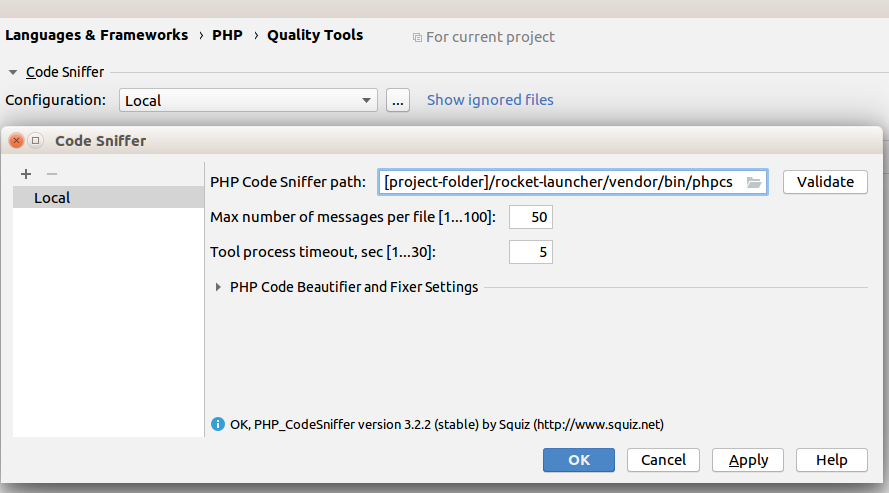
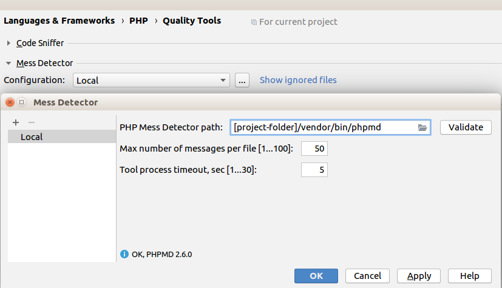
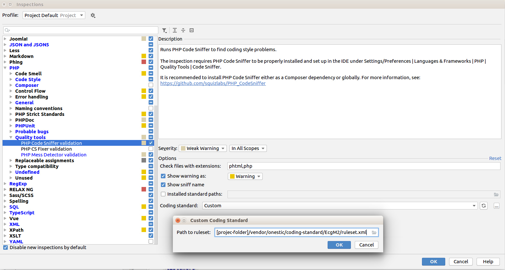
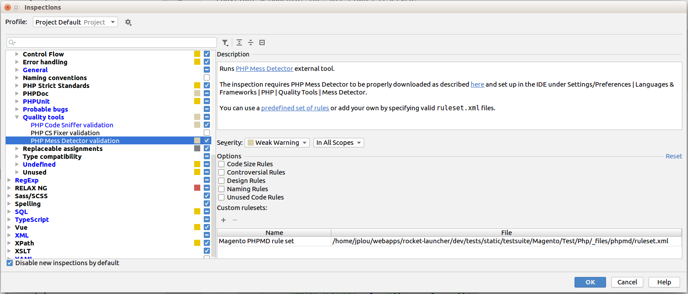

# Coding Standard setup

For applying most of defined format rules in PhpStorm, load [php-code-style.xml file](../files/phpstorm/php-code-style.xml) from _"File > Default Settings... / Settings..."_ and _"Editor > Code Style > Import Scheme > Intellij IDEA code style XML"_

## Index
* [How to start](#markdown-header-how-to-start)
* [CS & MD in PhpStorm](#markdown-header-code-sniffer--mess-detector-configurations-in-phpstorm)
* [GrumPHP](#markdown-header-grumphp)


## How to start

You'll need to require component in project's composer.json

```composer require --dev onestic/coding-standard:1.0.0```

## Code Sniffer (CS) & Mess Detector (MD) configurations in PhpStorm

First you have to enable CS and MD in project configuration in _"Languages & Frameworks > Php > Quality tools"_ and set executable files from _[project-folder]/vendor/bin/_ folder.





In old PhpStorm versions, CS and MD configurations are managed from _"Php > Code Sniffer"_ and _"Php > Mess Detector"_ options.


To set both sniffers check inspector configuration in _"Settings > Editor > Inspections > Php"_ and check this options:

1 - In Code Sniffer config, _"Coding Standard"_ option must be set to _"Custom"_ and in file selector, ruleset.xml file path must be set to _[project-folder]/vendor/onestic/coding-standard/Ecg2/ruleset.xml_

In option block _"Check files with extension"_ set value _php,phtml_ for sniffing this files (old PhpStorm versions doesn't have this extension management or have checkboxes to set extensions).


  
2 - In Mess Detector config, check set options are:
 
- Naming Rules

- Unused Code Rules

And set Code Size Rules from our custom ruleset in: _[project-folder]/vendor/onestic/coding-standard-files/phpmd/codesize.xml_



## GrumPHP

https://github.com/phpro/grumphp

GrumPHP is a tool for validating your code before commit it to repository.

Always check defined ruleset files in GrumPHP are the same used by PhpStorm:

**Magento 2**

```yml
...
phpcs:
    standard: "%magento_dir%/vendor/onestic/coding-standard/EcgM2"
...
phpmd:
    ruleset: ["%magento_dir%/dev/tests/static/testsuite/Magento/Test/Php/_files/phpmd/ruleset.xml"]
... 
```

**Magento 1**

```yml
...
phpcs:
    standard: 'vendor/onestic/coding-standard/Ecg/'
...
phpmd:
    ruleset: ['vendor/onestic/coding-standard/files/phpmd/codesize.xml', 'naming', 'unusedcode']
... 
```
